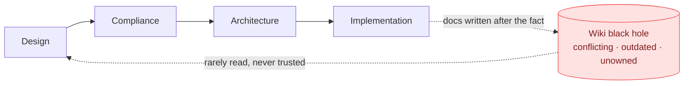
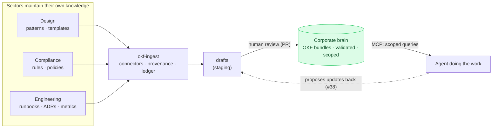

# The inversion of knowledge

Why this repo is shaped the way it is: scopes, provenance, a curation gate —
instead of just a search index over a wiki.

## The traditional pipeline: knowledge as exhaust

In the traditional development cycle, work flows *through* the sections of a
company — design, compliance, architecture — down to the people implementing
it. Knowledge is produced at the **end**: after shipping, someone commits
documentation about what was done into a wiki, where it joins everything else
ever written there. Nobody owns it, nothing validates it, and the next reader
finds three conflicting versions of the same definition, none of them dated.
Knowledge is the pipeline's exhaust, and the wiki is where exhaust goes.

Agents make this failure mode expensive in a new way. A human who distrusts
the wiki asks a colleague; an agent that lacks context **guesses** — a
plausible-but-wrong table name, a stale metric definition, an invented
process. Most agent inefficiency isn't reasoning failure, it's context
starvation, and the traditional pipeline starves every agent by design.

## The inverted pipeline: knowledge as input

The inversion: each sector of the company **maintains** its knowledge —
processes, rules, best practices, design patterns, decisions — as a living,
owned artifact in its own tools. That knowledge flows *into* a corporate
brain, and the brain is queried **at the start** of every piece of work, by
every agent, through one interface. Corporate knowledge generation moves from
the end of the pipeline to its beginning.

One refinement to the picture: the brain the agent experiences is singular —
one MCP surface, one query model — but the brain the organization maintains
is **federated**: one bundle per sector or sensitivity tier, each its own
repository with its own owners and access control. The agent sees one brain;
the company maintains many small, owned ones. That is the version of the
vision that survives contact with compliance.

## Vision → mechanism

Every element of the inversion maps to a concrete mechanism in this repo:

| Vision element | Mechanism here |
|---|---|
| Sectors maintain their own knowledge | `Source` connectors (git, Drive, S3) pull from *their* tools; `owner:` on every concept; one git repo per bundle behind the knowledge root |
| It flows into the brain — traceably | Provenance frontmatter (`source:`, `source_rev:`, `ingested_at:`) + the ledger classifying every upstream doc as new / unchanged / modified / removed |
| Arbitrary documents become knowledge | The transformer seam: passthrough for OKF-shaped sources, a toolless LLM worker + deterministic gate for prose |
| A corporate brain, not a dump | Curation via PR (the ingester **proposes, never publishes**) + validator in CI — broken or unreviewed knowledge cannot land |
| MCP interface for agents | `okf-mcp`: ranked search with curated aliases, `get_concept`, `follow_links` across the graph (including cross-bundle edges), `resolve_resource` |
| The whole company in one brain | The scope model: per-session visibility by set intersection, so restricted and public knowledge coexist without a global dump; resource access separately granted and audit-logged |
| Agents get what they need at task start | The [demo walkthrough](demo.md): definition → backing table → producer → runbook → data pointer in five tool calls, zero guessing |

### Why the brain doesn't become the wiki

The wiki's two diseases were **conflict** and **staleness**. The counters are
structural, not aspirational:

- *Conflict* — one concept per stable id; decisions recorded as ADRs (see the
  MRR single-source-of-truth story); everything enters through a reviewed PR
  where contradictions are reconciled instead of accumulating.
- *Staleness* — `timestamp:` on every concept, `log.md` per bundle, and the
  ingest ledger flagging when an upstream source document changed or vanished
  (never silently, never auto-deleted).
- *Trust* — the deliberate non-automation. The ingester and the LLM
  transformer only produce **drafts**; a human gate stands between every
  source and the served brain. A brain that auto-ingests without review is
  just the old wiki with an API. The gate is what keeps agents *using* the
  brain instead of second-guessing it.

## What's demonstrated vs. what's open

This repo is a working proof of the mechanism, at demo scale. How a company
would actually plug its sectors in is documented as example configurations —
compliance in git, design in Drive, data engineering in S3, each with its own
transformer and scope — in
[usage → federated sector sources](usage.md#example-federated-sector-sources);
a runnable multi-sector fixture is deliberately not built. The remaining gaps
between demo and vision are tracked as issues:

- **Draft promotion** ([#37](https://github.com/th-lange/okf-corporate-bundle/issues/37))
  — reviewed drafts still travel from staging to bundle by hand;
  `okf-ingest propose` should prepare the branch/PR in the knowledge repo.
- **Closing the loop** ([#38](https://github.com/th-lange/okf-corporate-bundle/issues/38))
  — the inversion becomes a cycle when agents propose knowledge back
  (a runbook learned, an alias missing, a decision made) through the same
  gate as everything else.

And one boundary worth keeping: the brain holds **durable knowledge** —
definitions, rules, runbooks, decisions — not the work items flowing through
the pipeline. It feeds the ticket system; it doesn't replace it.
