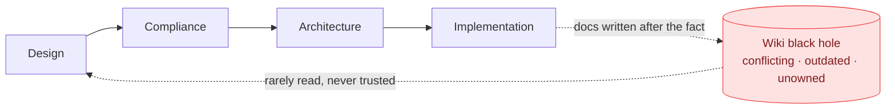
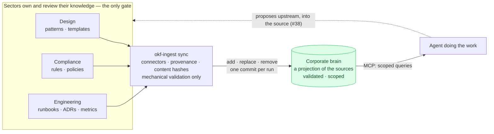

# The inversion of knowledge

Why this repo is shaped the way it is: scopes, provenance, a curation gate —
instead of just a search index over a wiki.

## The traditional pipeline: knowledge as exhaust

In the traditional development cycle, work flows *through* the sections of a
company — design, compliance, architecture — down to the people implementing
it. Knowledge is produced at the **end**: after shipping, someone commits
documentation about what was done into a wiki, where it joins everything else
ever written there. Nobody owns it, nothing validates it, and the next reader
finds three conflicting versions of the same definition, none of them dated.
Knowledge is the pipeline's exhaust, and the wiki is where exhaust goes.

Agents make this failure mode expensive in a new way. A human who distrusts
the wiki asks a colleague; an agent that lacks context **guesses** — a
plausible-but-wrong table name, a stale metric definition, an invented
process. Most agent inefficiency isn't reasoning failure, it's context
starvation, and the traditional pipeline starves every agent by design.

## The inverted pipeline: knowledge as input

The inversion: each sector of the company **maintains** its knowledge —
processes, rules, best practices, design patterns, decisions — as a living,
owned artifact in its own tools. That knowledge flows *into* a corporate
brain, and the brain is queried **at the start** of every piece of work, by
every agent, through one interface. Corporate knowledge generation moves from
the end of the pipeline to its beginning.

**Source authority: the gate lives upstream.** Publishing to a sector's
source *is* publishing to the brain — the sector's own review process
(their repo's PRs, their editorial flow) is the only editorial gate, because
re-reviewing at ingestion would be double review and would quietly undermine
ownership. What the pipeline keeps is *mechanical* validation, not judgment:
the validator must pass, scope fields can never come from source content,
provenance is stamped by the machine. The flip side is stated plainly: write
access to a source is write access to corporate truth, so source-side access
control is the security boundary.

One refinement to the picture: the brain the agent experiences is singular —
one MCP surface, one query model — but the brain the organization maintains
is **federated**: one bundle per sector or sensitivity tier, each its own
repository with its own owners and access control. The agent sees one brain;
the company maintains many small, owned ones. That is the version of the
vision that survives contact with compliance.

## Vision → mechanism

Every element of the inversion maps to a concrete mechanism in this repo:

| Vision element | Mechanism here |
|---|---|
| Sectors maintain their own knowledge | `Source` connectors (git, Drive, S3) pull from *their* tools; `owner:` on every concept; one git repo per bundle behind the knowledge root |
| A sector's publish is the brain's truth | Source authority: sync mirrors the sources (add / replace / remove); the sector's own review is the only gate; the pipeline validates mechanically, never editorially |
| It flows into the brain — traceably | Provenance frontmatter (`source:`, `source_rev:`, `ingested_at:`) + the ledger classifying every upstream doc as new / unchanged / modified / removed |
| Old knowledge is invalidated, not accumulated | Hash-keyed identity: content hashes detect real change (not revision churn), preserve identity across renames, resurrect removed concepts when content returns; deletions land as git commits — history is the tombstone, `git revert` the recovery |
| Arbitrary documents become knowledge | The transformer seam: passthrough for OKF-shaped sources, a toolless LLM worker + deterministic checks for prose; a failed conversion never replaces its predecessor (last-known-good) |
| MCP interface for agents | `okf-mcp`: ranked search with curated aliases, `get_concept`, `follow_links` across the graph (including cross-bundle edges), `resolve_resource` |
| The whole company in one brain | The scope model: per-session visibility by set intersection, so restricted and public knowledge coexist without a global dump; resource access separately granted and audit-logged |
| Agents get what they need at task start | The [demo walkthrough](demo.md): definition → backing table → producer → runbook → data pointer in five tool calls, zero guessing |

### Why the brain doesn't become the wiki

The wiki's two diseases were **conflict** and **staleness**. The counters are
structural, not aspirational:

- *Conflict* — exactly one source authors any given concept, and every
  concept has one stable id; decisions are recorded as ADRs (see the MRR
  single-source-of-truth story). Contradictions can't accumulate in the
  brain because the brain doesn't accept contributions — it mirrors owners.
- *Staleness* — the brain cannot be staler than its sources: sync replaces
  modified concepts in place and **removes** what the owner removed, keyed
  on content hashes so no-op revisions don't churn and renames don't orphan.
  `timestamp:`, `log.md`, and git history make every change datable and
  reversible.
- *Trust* — provenance plus ownership. Every concept says exactly where it
  came from and at which revision; the sector that owns the source reviewed
  it in their own process. The old wiki failed because writing to it was
  consequence-free and reading it was verification-free; here, publishing is
  an owned act and every served statement is traceable to its owner.

## What's demonstrated vs. what's open

This repo is a working proof of the mechanism, at demo scale. How a company
would actually plug its sectors in is documented as example configurations —
compliance in git, design in Drive, data engineering in S3, each with its own
transformer and scope — in
[usage → federated sector sources](usage.md#example-federated-sector-sources);
a runnable multi-sector fixture is deliberately not built. The remaining gaps
between demo and vision are tracked as issues:

- **Source-authoritative sync** ([#37](https://github.com/th-lange/okf-corporate-bundle/issues/37))
  — the current implementation still stages drafts for review, a transition
  state; sync replaces it with direct mirroring: add / replace / remove per
  ledger classification, hash-keyed identity (rename detection,
  resurrection), one commit per run, last-known-good on failed conversions,
  and a post-sync integrity report of dangling links routed to source owners.
- **Closing the loop upstream** ([#38](https://github.com/th-lange/okf-corporate-bundle/issues/38))
  — agents never write to the brain; they propose changes to the owning
  sector's *source* (a PR in the sector's repo), the sector's own review
  decides, and the next sync brings accepted knowledge back. The inversion
  becomes a cycle without ever adding a second author to the brain.

And one boundary worth keeping: the brain holds **durable knowledge** —
definitions, rules, runbooks, decisions — not the work items flowing through
the pipeline. It feeds the ticket system; it doesn't replace it.
