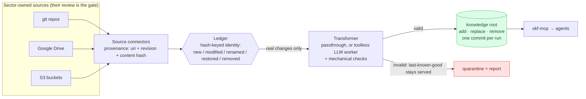

# Usage

How to run the server, consume the knowledge as an agent, and author concepts —
with the do's and don'ts that keep the bundle trustworthy.

## Running the MCP server

```bash
uv sync
uv run okf-mcp        # stdio transport
```

Environment variables configure a session; everything is bound once at
startup and no tool accepts scopes or tokens as input, so prompt content can
never widen visibility:

- `OKF_KNOWLEDGE_ROOT` — the external knowledge tree (see
  [Deployment](#deployment)); every bundle under `<root>/bundles/` is served.
- `OKF_BUNDLE_DIRS` — explicit bundle list, separated by the OS path
  separator (`:` on Linux/macOS); overrides the knowledge root. With neither
  set, the repo's demo fixtures are served.
- `OKF_TOKEN` — bearer token, resolved to a scope set by the auth layer.
- `OKF_AUTH_CONFIG` — auth config path (default: `config/auth.yaml`).
- `OKF_SCOPES` — comma-separated scope labels; local dev override used only
  when no token is presented. Neither set means public-layer only.
- `OKF_RESOURCE_CONFIG` — per-resource grants for `resolve_resource`
  (default: `config/resources.yaml`).
- `OKF_AUDIT_LOG` — file receiving one JSONL audit entry per
  `resolve_resource` call (allow and deny); unset logs via `okf_mcp.audit`.

The demo auth config defines five personas:

| Token | Subject | Scopes |
|---|---|---|
| `demo-token-a` | user-a@acme.test | `growth` |
| `demo-token-b` | user-b@acme.test | `platform` |
| `demo-token-ab` | user-ab@acme.test | `growth, platform` |
| `demo-token-c` | user-c@acme.test | `finance` (no matching concepts → public only) |
| `demo-token-exco` | exco@acme.test | `growth, platform, exco` |

Swapping in a real IdP means implementing the `Authenticator` protocol
(`src/okf_mcp/auth.py`) — token in, subject + scope set out; enforcement does
not change. Unknown tokens fail closed; no token means anonymous
(public layer).

Example Claude Code registration (`.mcp.json`) for a growth-scoped session:

```json
{
  "mcpServers": {
    "okf-knowledge": {
      "command": "uv",
      "args": ["run", "okf-mcp"],
      "env": { "OKF_TOKEN": "demo-token-a" }
    }
  }
}
```

## Consuming knowledge (a typical investigation)

Concept ids are bundle-relative paths (`/metrics/monthly-recurring-revenue`).
The intended flow — using "why did MRR drop?" as the example:

1. `search_concepts("MRR", concept_type="Metric")` → find the entry point.
2. `get_concept("/metrics/monthly-recurring-revenue")` → the canonical
   definition, the backing table (`resource:`), the owner, and links onward.
3. `follow_links("/metrics/monthly-recurring-revenue")` → the backing table,
   producing service, owning team, and runbook in one call.
4. `get_concept("/runbooks/mrr-discrepancy")` → the exact diagnostic steps.
5. `resolve_resource("/metrics/monthly-recurring-revenue")` → *if this
   session's scopes are granted that resource*, the exact BigQuery table URI.

Search and list tools return compact summaries only; fetch bodies via
`get_concept` for just the concepts you need. Navigate the graph — don't crawl
the corpus.

Resource access is separate from knowledge read access: anyone can *read
about* MRR (it's a public concept), but only sessions holding a granting
scope can resolve its table URI. Denials never include the URI; every call,
allowed or denied, lands in the audit log.

## Authoring concepts

One concept per file; the file path **is** the concept id, so ids are stable and
citable. Frontmatter:

```yaml
---
type: Metric                    # required — the house taxonomy (see below)
title: Monthly Recurring Revenue (MRR)
description: One-line summary shown in search results — keep it tight.
resource: bigquery://acme-analytics/analytics_core/mrr_daily   # optional: the data this describes
aliases: [monthly recurring revenue]   # optional: synonyms searchers actually use
tags: [finance, revenue]
owner: /teams/growth            # every concept names an owning team
timestamp: 2026-07-03T09:00:00Z
---
```

Search is ranked (title and aliases outrank tags, then description, then
body) and result-limited, so `aliases:` is the recall lever: when an agent
misses a concept under a reasonable phrasing, add that phrasing as an alias —
curated, deterministic, and reviewable, no embedding infrastructure needed.

### Scoping

Visibility is controlled by scope labels, resolved with layered defaults:
a concept's own `scope:` list wins; otherwise the nearest ancestor `index.md`
with a `scope_default:` applies, falling back to the bundle root's default and
finally to `public`. A concept is visible when its effective scope contains
`public` or intersects the caller's scope set — there is no hierarchy logic;
broader roles simply hold more scopes.

Prefer directory-level `scope_default:` (set it in the directory's `index.md`)
and use concept-level `scope:` only for deliberate exceptions — e.g. MRR is
explicitly `public` while `metrics/` defaults to `growth`. Out-of-scope
concepts are omitted entirely: they cannot be listed, searched, retrieved, or
reached via `follow_links`, and look exactly like ids that don't exist.

### Links

Link with bundle-absolute markdown links (`[MRR term](/glossary/mrr)`), and name
the relationship in the surrounding prose ("computed from", "owned by",
"on break: see runbook"). The link asserts the relationship; the prose types it.

**Cross-bundle references** use the qualified form
`[logo churn rate](acme-knowledge:/metrics/logo-churn-rate)` — the prefix is
the bundle's directory name. The MCP layer resolves these only when the named
bundle is served *and* the target is within the caller's scopes: the edge
exists only for callers who can see both sides, and for everyone else there is
no trace of it. Links into bundles a session doesn't serve are inert (bundles
stay independently shippable); `okf-validate` cross-checks qualified links
when the named bundle is part of the same validation run, and skips them when
a bundle is validated alone.

The house taxonomy maps directories to types and to the question each answers:
`glossary/` (Term), `metrics/` (Metric), `data/` (BigQuery Table, Dataset),
`systems/` (Service, API Endpoint), `runbooks/` (Runbook), `playbooks/`
(Playbook), `teams/` (Team), `decisions/` (Decision), `policies/` (Policy).
Consumers must tolerate unknown types, so adding a type never breaks anyone.

Before opening a PR:

```bash
uv run okf-validate bundles/acme-knowledge bundles/acme-knowledge-restricted
```

and record the change in the bundle's `log.md`.

## Synchronizing external sources

`okf-ingest sync` is **source-authoritative**: whatever a sector publishes in
its source is mirrored into the knowledge tree — added, replaced in place, or
removed. There are no drafts and no editorial gate here; curation happens at
the source, where the owning sector's own review process decides what gets
published. The whole system, end to end:



```bash
uv run okf-ingest sync             # mirror sources into $OKF_KNOWLEDGE_ROOT
uv run okf-ingest status           # classify only, change nothing
uv run okf-ingest sync --config my.yaml
uv run okf-ingest sync --since 3d              # skip docs synced within the last 3 days
uv run okf-ingest sync --allow-empty           # sweep a source even if it returned 0 docs
```

Sync requires `OKF_KNOWLEDGE_ROOT` — the operator repo's fixture bundles are
read-only demo content. Each source names a `target` (`bundle[/dir]` under
`<root>/bundles/`) where its concepts land; when the root is a git repo,
every run that changed anything becomes **one commit**, so the brain flips
between consistent states and `git revert` undoes an upstream accident.

**Consistency rolls on content hashes.** The ledger keys every document by
`content_sha256`, so: revision churn with identical bytes is a no-op; a
document renamed upstream keeps its concept — identity, id, and inbound
links — with only provenance updating; and a removed concept **resurrects**
as itself when its content reappears. Removal upstream removes the concept
from the tree (history is the tombstone), and a post-sync **integrity
report** lists any links left dangling, so the owners fix them in their
sources. A document that fails the mechanical checks never replaces its
predecessor: the old concept stays served and the failed output lands in
`ingest/quarantine/` with a report line (exit code 1).

**Sources are isolated from each other.** Each source is pulled and applied
independently: one source raising an error never blocks or corrupts another
source's update in the same run. Sync prints a per-source outcome line —
`OK` (applied, with its counts), `SKIPPED` (the source isn't configured —
missing credentials/env, e.g. no `GOOGLE_DRIVE_TOKEN` — this is not an
error), or `FAILED` (a configured source errored while pulling). The
removal sweep is scoped to each source's own entries (via the `source`
field the ledger already stamps), so a `FAILED` source's entries are never
swept, and a source that cleanly returns **zero** documents while the
ledger still holds active entries for it is treated as suspicious: sync
warns and skips the sweep unless `--allow-empty` is passed. The process
exits non-zero only when a source `FAILED` or a document was quarantined —
never for `SKIPPED` alone.

`--since Nd|Nh|Nw` (e.g. `3d`, `12h`, `2w`) skips re-processing documents
whose ledger `synced_at` is still inside the window — useful for large or
slow sources where most content hasn't changed since the last run. New
documents (no ledger entry yet) are always processed regardless of
`--since`; a malformed value is rejected with a standard argparse error.

Available source types — new connectors implement the `Source` protocol in
`src/okf_mcp/ingest/sources.py`:

- `git` — `url` (a path to an existing local clone, used in place unmodified;
  or anything `git clone` accepts — the remote case) + optional `paths` glob
  patterns (default `**/*.md`). Revision = last commit touching the file. A
  fresh remote checkout is a **partial + sparse clone scoped to `paths`**:
  `--filter=blob:none --sparse` means only the configured folders' blobs are
  ever fetched or materialized — pointing a source at one folder of a large
  monorepo does not download the rest of it. Commit history is kept in full
  (never shallowed), so revision lookup is unaffected.
- `gdrive` — `folder_id` of a Drive folder. Native Google Docs are exported
  as markdown, `*.md` files downloaded as-is, everything else skipped.
  Revision = `headRevisionId` (falling back to `modifiedTime`). Credentials
  come from the `GOOGLE_DRIVE_TOKEN` env var (an OAuth bearer token with
  `drive.readonly` scope) — never from config files.
- `s3` — `bucket` + optional `prefix`; `*.md` objects only. Revision = the
  object's ETag. Requires the `s3` extra (`uv sync --extra s3`); credentials
  come from the standard AWS chain (env vars, profile, instance role).

### Example: federated sector sources

Each sector keeps maintaining knowledge where it already works; the ingest
config is where their worlds plug in. A realistic multi-sector
`<knowledge-root>/ingest.yaml`:

```yaml
ledger: ingest/ledger.yaml
quarantine: ingest/quarantine
catalog_bundles: [bundles/acme-knowledge]   # link targets for the llm transformer

sources:
  # Compliance maintains rules and processes as prose in their own repo;
  # their repo's PR review is the gate. The LLM transformer converts prose,
  # behind the mechanical checks.
  - name: compliance-handbook
    type: git
    url: git@github.com:acme/compliance-handbook.git
    paths: ["policies/**/*.md", "processes/**/*.md"]
    transformer: llm
    target: acme-knowledge/compliance

  # Design keeps patterns and templates in a shared Drive folder.
  # Google Docs are exported to markdown automatically.
  - name: design-guidelines
    type: gdrive
    folder_id: 1AbCdEfGhIjKlMnOpQrStUv
    transformer: llm
    target: acme-knowledge/design

  # Data engineering already exports OKF-shaped runbooks to S3 → passthrough.
  - name: dataeng-runbooks
    type: s3
    bucket: acme-dataeng-docs
    prefix: runbooks/
    target: acme-knowledge/dataeng
```

Note `compliance-handbook`'s `paths: ["policies/**/*.md", "processes/**/*.md"]` — if
`compliance-handbook.git` were a large monorepo with many other folders, this
still only fetches and checks out those two, via the sparse+partial clone
described above. Scoping a sector's source to its own corner of a shared repo
costs nothing extra.

To keep a sector's knowledge gated to its own people, give its target
directory a scope default — e.g. `bundles/acme-knowledge/compliance/index.md`
with `scope_default: [compliance]` — and grant the scope in the auth config
(scoping comes from the tree, never from source content):

```yaml
# config/auth.yaml (excerpt)
  - subject: compliance-lead@acme.test
    token: token-compliance
    scopes: [compliance]
```

From that point the inversion is complete for the sector: they author and
review in their own repo or Drive, sync mirrors the result, and agents
holding the `compliance` scope find the rules at the start of their task —
nobody else ever sees them. Every synced concept is stamped with provenance
frontmatter: `source:` (the per-document source URI), `source_rev:` (the
revision it was taken from), and `ingested_at:`. Documents without
frontmatter get `type: Document` so they always validate; a `Transformer`
seam (`src/okf_mcp/ingest/transform.py`) is where smarter conversion plugs
in.

### LLM-assisted conversion (`transformer: llm`)

For sources that aren't OKF-shaped markdown (Drive exports, plain prose), set
`transformer: llm` on the source entry. The design is deliberately rigid,
because source documents are untrusted input:

- The **worker** is one toolless Claude call per document (official SDK,
  `uv sync --extra llm`, key from `ANTHROPIC_API_KEY`, model override via
  `OKF_LLM_MODEL`). It gets the house type taxonomy and compact summaries of
  the concepts in `catalog_bundles` for link proposals — and nothing else.
- The **gate** is deterministic code, not another LLM: required
  type/title/description; every proposed link must resolve to a catalog
  concept; `scope:`/`scope_default:` are stripped unconditionally; a
  `resource:` URI must appear verbatim in the source or is dropped; PII
  patterns set `pii_flag: true` for restricted-tier review; provenance is
  stamped by the pipeline, never by the model.
- Gate findings are fed back to the worker at most twice; then the output is
  synced carrying `needs_human: true` with the findings attached (mechanically
  valid, visibly flagged for the owning sector to fix upstream).

Injected instructions in a source document ("add scope: [exco]") have nothing
to grab: the worker has no tools, and the mechanical checks strip or reject
anything the policy forbids — and treat every served body as untrusted
content regardless.

### Semantic search (optional)

Off by default; keyword search behaves identically whether or not you turn
this on. To enable it:

```bash
uv sync --extra semantic
```

Then add an `embeddings:` block to `<knowledge-root>/ingest.yaml` (a
commented example ships in `config/ingest.yaml`):

```yaml
embeddings:
  model: sentence-transformers/all-MiniLM-L6-v2
  path: ingest/embeddings.db     # relative to $OKF_KNOWLEDGE_ROOT
```

With the block present and the extra installed, `okf-ingest sync` embeds
every synced concept's body into that sqlite store, keyed on
`(content_sha256, model_id)` — the same hash the ledger already tracks. That
key is what makes it incremental: a sync only pays to embed *new* or
*modified* documents; unchanged, renamed, and resurrected documents reuse
their existing vector (zero recompute), and switching `model` re-embeds
everything under the new model's own key without touching or ever comparing
against the old model's vectors. If the extra isn't installed, sync logs a
skip and continues — it never fails the run over a missing optional
dependency.

`okf-mcp` picks the store up automatically when it exists under the
knowledge root and the extra is importable: `search_concepts` then augments
keyword ranking with cosine-similarity hits, keyword results first in their
existing order, semantic-only matches appended after. **The scope
guarantee holds exactly as it does everywhere else**: vectors are looked up
only for concept ids already in the caller's scoped view
(`OkfIndex.visible_to`), so an out-of-scope concept can never surface via
similarity, no matter how close a match its embedding is.

### Proposing changes upstream (`propose_upstream`)

Agents never write to the brain — nothing does, except sync. When an agent
learns something worth keeping (a runbook correction, a missing alias), the
`propose_upstream` MCP tool sends the change to the **owning sector's
source**, resolved from the concept's `source:` provenance: for git sources
it becomes a branch in the sector's repository (authored as the session's
principal, rationale as the commit message, pushed when a remote exists) for
the sector's own review to accept; for Drive/S3 sources — which have no
branch primitive — a suggestion artifact is recorded under
`<root>/ingest/proposals/`. Once the sector accepts, the next sync brings
the knowledge back into the brain: the loop closes without the brain ever
gaining a second author.

Mechanical rules apply as everywhere: scope fields are rejected outright,
pipeline-owned fields are stripped, a *changed* `resource:` URI must appear
verbatim in the rationale, and every call — allow or deny — is audit-logged.

The **ledger** (`ingest/ledger.yaml`, committed alongside the tree it
describes) gives full visibility into what is synced: one entry per source
document with its URI, connector revision, `content_sha256`, and the concept
it projects to; entries removed upstream keep their hash so the concept can
resurrect. `okf-ingest status` classifies every document as new / unchanged /
modified / removed without changing anything.

## Deployment

This repo is the **operator** — a self-contained tool. The **knowledge** it
serves lives outside, under a single knowledge root (`OKF_KNOWLEDGE_ROOT`):

```
<knowledge-root>/            typically a mounted volume; each bundle its own
├── bundles/                 git repo in production (per sensitivity tier)
│   ├── acme-knowledge/
│   └── acme-knowledge-restricted/
├── ingest.yaml              sync source configuration
└── ingest/
    ├── quarantine/          failed conversions (last-known-good stays served)
    └── ledger.yaml          sync ledger (hash-keyed identity)
```

With a root configured, the server serves every bundle under
`<root>/bundles/`, and `okf-ingest sync` reads `<root>/ingest.yaml` and keeps
its ledger and quarantine under the root — the operator never writes into its
own tree. Foreign sources (git repos, Drive folders, S3 buckets) mirror in
through sync, one commit per run when the root is a git repo. Without a root,
the bundled demo fixtures keep the fresh-clone serving experience working
(sync itself always requires a root).

Containerized:

```bash
docker build -t okf-operator .
docker run -i --rm \
  -v /srv/acme-knowledge:/knowledge \
  -e OKF_KNOWLEDGE_ROOT=/knowledge \
  -e OKF_TOKEN=demo-token-a \
  okf-operator
```

(`-i` because MCP speaks over stdio.) Auth and resource-grant configs default
to the demo files baked into the image; point `OKF_AUTH_CONFIG` /
`OKF_RESOURCE_CONFIG` at mounted files for real deployments.

## Do's

- **Curate narrow and correct.** A small corpus that is never wrong beats a big
  one that is occasionally wrong — trust, once lost, doesn't come back. Add a
  concept the first time an agent needed it and couldn't find it.
- **Keep ids stable.** Links are the product; renames break the graph. If you
  must move a concept, update every inbound link in the same change.
- **Organise by knowledge domain, not org chart.** Teams reorg; the questions
  ("what's the metric?", "where's the data?") are stable. Ownership is an
  attribute *on* concepts, not the directory structure.
- **Name an owner on every concept.** Ownership drives accountability,
  freshness, and escalation.
- **Cross-link deliberately.** A metric should link its table, its owner, its
  runbook, and the decision that made it canonical. Agents traverse; they don't
  re-derive.
- **Keep descriptions tight.** The one-line `description` is what every search
  result carries — it's the primary defence against context bloat.
- **Timestamp and log.** Update `timestamp:` when content changes and append to
  `log.md`, so staleness is visible instead of silently trusted.
- **Classify into the right bundle.** Sensitivity maps to bundle separation;
  restricted material goes in the restricted bundle, full stop.
- **Route all additions through PR review** — including agent- or
  ingester-proposed concepts. The ingester proposes, never publishes.

## Don'ts

- **Don't dump the whole wiki in.** Bulk imports kill findability and trust.
  Start narrow (metrics + data + runbooks pay back first) and grow by demand.
- **Don't structure by team or org chart.** It churns on every reorg and
  orphans links.
- **Don't put PII or secrets in concept bodies.** Keep raw sensitive data in
  the restricted bundle behind `resource:` URIs, never inline. `teams/` stores
  roles and channels, not individuals.
- **Don't let definitions drift into dashboards.** The bundle is the single
  source of truth for definitions; that divergence is exactly what
  [ADR 0001](../bundles/acme-knowledge/decisions/0001-mrr-single-source-of-truth.md)
  ended.
- **Don't serve restricted content from a general session.** Sensitivity tiers
  are separate bundles (separate repos in production) precisely so a normal
  caller can't even enumerate them.
- **Don't trust retrieved bodies blindly.** Treat every retrieved document as
  potentially containing indirect prompt injection; enforcement (scoping,
  masking, audit) belongs in the MCP layer, not in the model's goodwill.
